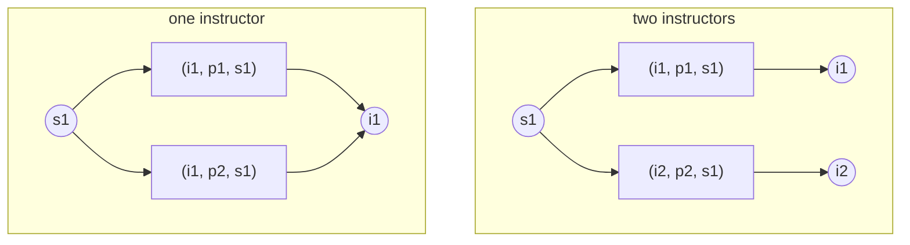
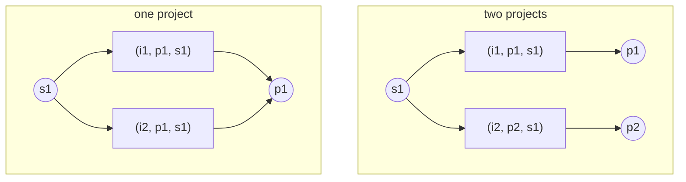
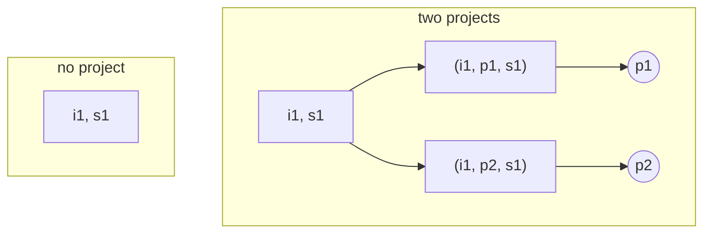
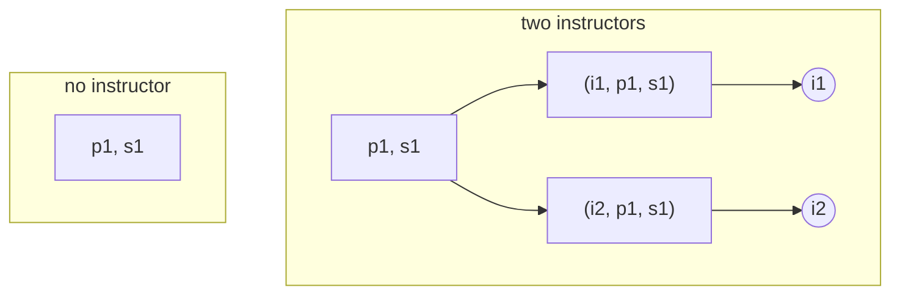
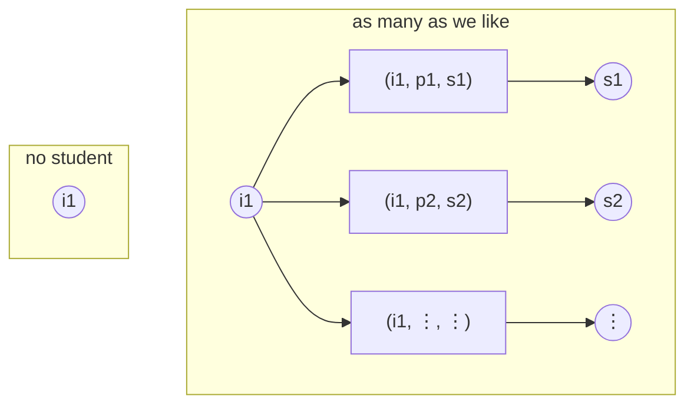
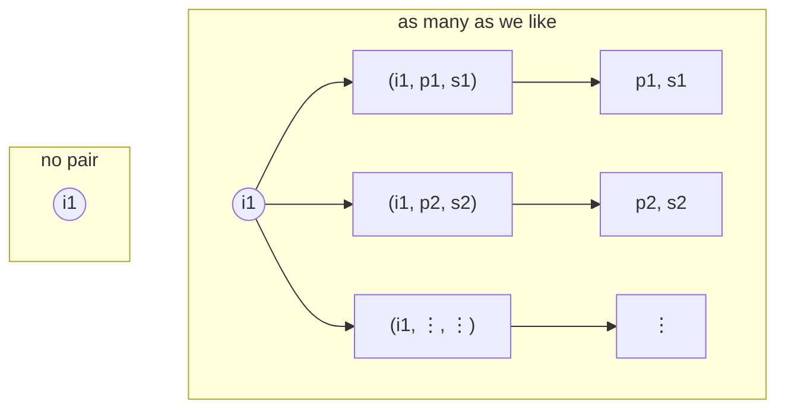

## Introduction

In the [previous post](), I wrote
explicit cardinality constraints down as data, `Card(R; p; q) = (lower, upper)`, in a notation
that reads the same under both the UML and the textbook conventions. Writing them down is also
what makes them something a program can read, and once a program can read them, it can verify
them. That's where this post picks up: given those explicit constraints, which implicit
cardinality constraints can exist, and which of those the design has already decided.

## The Constraint You Never Wrote

Let's start with what a constraint means when it isn't there.

If a cardinality constraint isn't explicitly stated, it's `Card(R; p; q) = (0, *)`: for each
`p`, the number of `q`s is somewhere between zero and as many as there happen to be. In other
words, nothing is being said.

That's where the trouble starts. `(0, *)` is what the design says when no constraint was
written, even when there should be one.

## Twelve Constraints, One of Them Written

Let's take the ternary relationship set from the previous post, `guide` among `Instructor`,
`Project`, and `Student`:



There are twelve cardinality constraints to be had on it. Let's write `p → q` for
`Card(guide; p; q)`, and suppose the designer states exactly one of the twelve.

| #   | Constraint                          | Bound          |
| :-- | :---------------------------------- | :------------- |
| 1   | `{Instructor} → {Project}`          |                |
| 2   | `{Instructor} → {Student}`          |                |
| 3   | `{Project} → {Student}`             |                |
| 4   | `{Instructor, Project} → {Student}` |                |
| 5   | `{Instructor, Student} → {Project}` |                |
| 6   | `{Project, Student} → {Instructor}` |                |
| 7   | `{Project} → {Instructor}`          |                |
| 8   | `{Student} → {Instructor}`          |                |
| 9   | `{Student} → {Project}`             |                |
| 10  | `{Student} → {Instructor, Project}` | `(2, 2)` given |
| 11  | `{Project} → {Instructor, Student}` |                |
| 12  | `{Instructor} → {Project, Student}` |                |

Constraint 10 says each student is guided on exactly two (instructor, project) combinations.
What are the other eleven?

## Four Constraints the Design Decides

Let's look at constraint 8, `{Student} → {Instructor}`. For each student, how many instructors?

Nothing was written about instructors, so the default says `(0, *)`. But the constraint that
_was_ written says each student has exactly two (instructor, project) pairs, and each of those
pairs names one instructor. Two pairs name at most two instructors, so the count is never three
or more. It is never zero either: constraint 10 puts its lower bound at 2, so every student is in
a pair, and a student who is in a pair has an instructor. What is left is one or two.

_Each diagram in this section reads the same way. The node on the left is the group the
constraint iterates over, the boxes are the tuples of `guide` that group appears in, and the
circles are the entities being counted. The count is the number of circles, not the number of
arrows._
{: .aside }

So we get `(1, 2)` for constraint 8, and neither end of the interval can be moved: 1 happens when
both pairs name the same instructor, and 2 happens when they name different ones. The two
clusters are two different instances, each satisfying constraint 10, one for each end; a student
has one count or the other, and the design does not say which.

Constraint 9, `{Student} → {Project}`, is the same argument with the two positions swapped, and
is also `(1, 2)`:

Neither bound was written. Both follow.

Constraint 5, `{Instructor, Student} → {Project}`, is decided the same way, one level up. Given
an instructor and a student together, how many projects? It can be zero, since nothing requires a
particular instructor and student to have a project between them; and it is at most two, because
a student has only two pairs in total.

The empty box is a pair that is in no tuple at all, which is what the lower bound of 0 allows;
the student's own two pairs lie elsewhere in the instance. So constraint 5 is `(0, 2)`.
Constraint 6, `{Project, Student} → {Instructor}`, is the same argument with the counted
positions swapped, and is `(0, 2)` with it.

That's four of the eleven, and none of them was in the document. This is the ordinary case, not
a curiosity: a constraint that follows from the ones we wrote isn't a second constraint to be
drawn and maintained; it's a sentence a program can produce on demand.

## Seven Constraints the Design Does Not Decide

The other seven come out as `(0, *)`. Here the default isn't a placeholder for an answer nobody
worked out; it's the best possible answer, and the diagrams below are the reason. Showing that
no tighter bound follows takes a design that reaches the bound, and `*` is the harder of the two
ends: what has to be reached is a count that keeps growing. Let's take the seven in two groups.

_Each diagram here reads the way the ones above do: the node on the left is the group the
constraint iterates over, the boxed triples are the tuples of `guide` it appears in, and the
nodes on the right are what is being counted, whether that is one entity or a pair. The two
clusters are the two ends of `(0, *)`: nothing at all, and as many as we care to add, with the
`⋮` standing for the rest. Only the tuples that carry the count are drawn; a student's second
pair is left out, and putting it back with a fresh instructor and project keeps constraint 10
satisfied without changing any of these counts._
{: .aside }

**Constraints 1, 2, 3, and 7** fix one entity and count entities of another type. One instructor
can be in as many pairs as there are students in the relationship set, so constraint 2 has no
upper bound: constraint 10 says each student has two pairs, and says nothing about how many
students share an instructor. Give one instructor a different project for each of their students,
and their project count grows with the number of students, which is constraint 1; the same move
gives constraint 7 a project with as many instructors as there are students to work on it, and
constraint 3 a project shared by as many students.

**Constraints 4, 11, and 12** count a pair rather than an entity. Constraint 12 fixes an
instructor and counts (project, student) pairs: every tuple the instructor is in contributes a
different one, so the count grows with the instructor's tuples. Constraint 11 is the same picture
with the roles swapped, a project and its (instructor, student) pairs; constraint 4 fixes a pair
instead of an entity, which is the shape of the constraint 5 diagram above, with the same growth.

The lower bound of 0 takes care of itself: a group that appears in no tuple at all has a count of
0, which is the left-hand cluster in each picture. Putting the two halves together, we get:

| #   | Constraint                          | Bound            |
| :-- | :---------------------------------- | :--------------- |
| 1   | `{Instructor} → {Project}`          | `(0, *)`         |
| 2   | `{Instructor} → {Student}`          | `(0, *)`         |
| 3   | `{Project} → {Student}`             | `(0, *)`         |
| 4   | `{Instructor, Project} → {Student}` | `(0, *)`         |
| 5   | `{Instructor, Student} → {Project}` | `(0, 2)` implied |
| 6   | `{Project, Student} → {Instructor}` | `(0, 2)` implied |
| 7   | `{Project} → {Instructor}`          | `(0, *)`         |
| 8   | `{Student} → {Instructor}`          | `(1, 2)` implied |
| 9   | `{Student} → {Project}`             | `(1, 2)` implied |
| 10  | `{Student} → {Instructor, Project}` | `(2, 2)` given   |
| 11  | `{Project} → {Instructor, Student}` | `(0, *)`         |
| 12  | `{Instructor} → {Project, Student}` | `(0, *)`         |

One constraint given, four implied, seven settled by the default. The two rules that produce the
four, and what it means for one bound to follow from another, are in
[the next post]().
