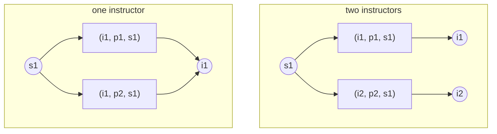
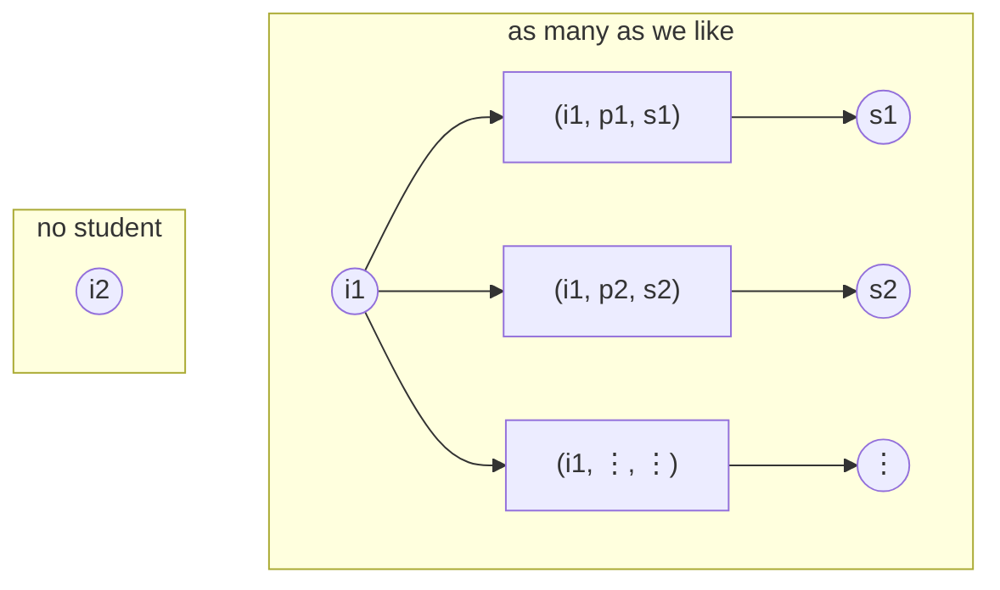

## Introduction

In the [previous post](), I discussed how one
explicitly written cardinality constraint on the ternary relationship (i.e., `guide`) could lead to multiple
implicit ones. However, I discussed it using a concrete example which seems not to be generalizable.
Therefore, in this post, I will discuss how we can infer those implicit rules: the two rules behind them.

The constraint numbers below are that post's, collected here so that a number can be looked up
without leaving the page. The four marked `implied` are the ones this post derives; the rest are
left at the default.
{: .aside }

| #   | Constraint                          | Bound            |
| :-- | :---------------------------------- | :--------------- |
| 1   | `{Instructor} → {Project}`          | `(0, *)`         |
| 2   | `{Instructor} → {Student}`          | `(0, *)`         |
| 3   | `{Project} → {Student}`             | `(0, *)`         |
| 4   | `{Instructor, Project} → {Student}` | `(0, *)`         |
| 5   | `{Instructor, Student} → {Project}` | `(0, 2)` implied |
| 6   | `{Project, Student} → {Instructor}` | `(0, 2)` implied |
| 7   | `{Project} → {Instructor}`          | `(0, *)`         |
| 8   | `{Student} → {Instructor}`          | `(1, 2)` implied |
| 9   | `{Student} → {Project}`             | `(1, 2)` implied |
| 10  | `{Student} → {Instructor, Project}` | `(2, 2)` given   |
| 11  | `{Project} → {Instructor, Student}` | `(0, *)`         |
| 12  | `{Instructor} → {Project, Student}` | `(0, *)`         |

## The Two Rules

I refer these two rules as the _decomposition_ rule and the _augmentation_ rule.

### Decomposition

Decomposition relates a group to a larger group that contains it. If each `q` has to
come with at least one `s`, then the number of `q`s can never exceed the number of `(q, s)` pairs:

$$
\begin{aligned}
C_{\min}(R; p; q \cup s) &\geq C_{\min}(R; p; q)
\end{aligned}
$$

$$
\begin{aligned}
C_{\max}(R; p; q \cup s) &\geq C_{\max}(R; p; q)
\end{aligned}
$$

Knowing a bound on `p` over the pair-group $q \cup s$, we can therefore bound `p` over the
smaller group `q`. Constraint 10 is a bound on `{Student}` over `{Instructor, Project}`, so
decomposing gives bounds on `{Student}` over `{Instructor}` and over `{Project}`: constraints 8
and 9, `(1, 2)` each. The maximum carries over unchanged. The minimum can drop since
there could be two pairs naming the same instructor. It can't drop below 1, because a student who has a pair
at all has an instructor. Both of these instances give `s1` the two pairs that constraint 10
asks for:

One cluster gives `s1` a single instructor, the other gives two, and those are the two ends of
the interval:

`{Student} → {Instructor, Project}` = `(2, 2)` ⇒ `{Student} → {Instructor}` = `(1, 2)`

### Augmentation

Augmentation relates a group to a larger group that contains it on the other side. An
`(p, s)`-pair determines a `p`, and the `q`s available to the pair are among those available to
that `p`. So anything true of every `p` is true of every `(p, s)` as well, and the bound tightens
with the requirement:

$$
\begin{aligned}
C_{\min}(R; p \cup s; q) &\geq C_{\min}(R; p; q)
\end{aligned}
$$

$$
\begin{aligned}
C_{\max}(R; p \cup s; q) &\leq C_{\max}(R; p; q)
\end{aligned}
$$

Constraint 10 is a bound on `{Student}`, so it's also a bound on `{Instructor, Student}` and on
`{Project, Student}`: constraints 5 and 6, each `(0, 2)`. The upper bound of 2 is inherited from
constraint 10. The lower bound stays at the default of 0, because nothing in the design requires
a given instructor and student to be working on anything together.

Suppose the pair-group is where the tight bound sits instead: `{Instructor, Project} → {Student}` =
`(1, 1)`, every pair in exactly one tuple. Counting students per instructor, both ends of `(0, *)`
are reachable:

One cluster gives `i1` a student per pair, without limit; the other gives `i2` none, since `i2` is
in no pair. Those are the two ends of `(0, *)`:

`{Instructor, Project} → {Student}` = `(1, 1)` ⇒ `{Instructor} → {Student}` = `(0, *)`

The two rules lean in opposite directions and both lose information. Decomposition shrinks the
group being counted; augmentation shrinks the group being iterated over. Neither ever produces a
bound tighter than the default on its own authority: the minimum of a derived constraint is 1
only when the constraint it came from forces it to be.

## Implied, Redundant, or Contradictory

Bounds are intervals, so a constraint `Card(R; p; q) = (l, u)` is contained in another,
`(l', u')`-shaped one, exactly when `l ≥ l'` and `u ≤ u'` (_i.e._, when its interval sits inside
the other). The contained constraint is the stronger statement, since it rules out more
instances. Two constraints on the same `(R; p; q)` combine to `(max(l, l'), min(u, u'))`, and the
pair is contradictory exactly when that interval is empty.

With that in hand:

- A constraint is **implied** when the rest of the design already forces something at least as
  strong.
- It is **redundant** when it is implied and adds nothing.
- The design is **contradictory** when two written constraints have no interval in common.

Two bounds that merely differ are neither. A design that says `(1, 5)` for constraint 8, when
constraint 10 forces `(1, 2)`, isn't in conflict with itself; it just has a loose bound in it,
which is the sort of thing a marker would want to know and a program can point out for free.

## One Tuple

Let's change the one constraint that is written, and the whole set of bounds changes with it.

Suppose constraint 10 is `(1, 1)` instead of `(2, 2)`: each student is guided on exactly one
(instructor, project) pair. Then constraints 5, 6, 8, and 9 all become `(0, 1)` (at most one,
with no lower bound), and the rest stay at the default.

| #   | Constraint                          | Bound            |
| :-- | :---------------------------------- | :--------------- |
| 5   | `{Instructor, Student} → {Project}` | `(0, 1)` implied |
| 6   | `{Project, Student} → {Instructor}` | `(0, 1)` implied |
| 8   | `{Student} → {Instructor}`          | `(0, 1)` implied |
| 9   | `{Student} → {Project}`             | `(0, 1)` implied |
| 10  | `{Student} → {Instructor, Project}` | `(1, 1)` given   |
