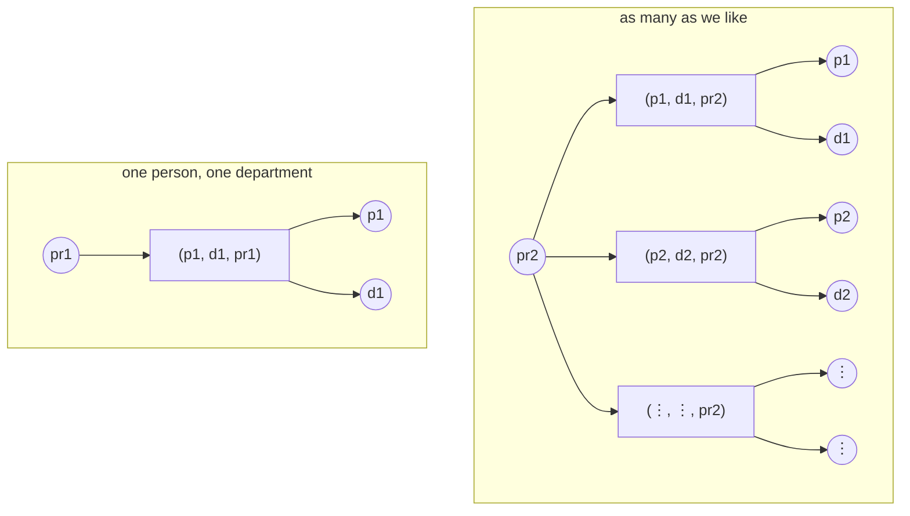
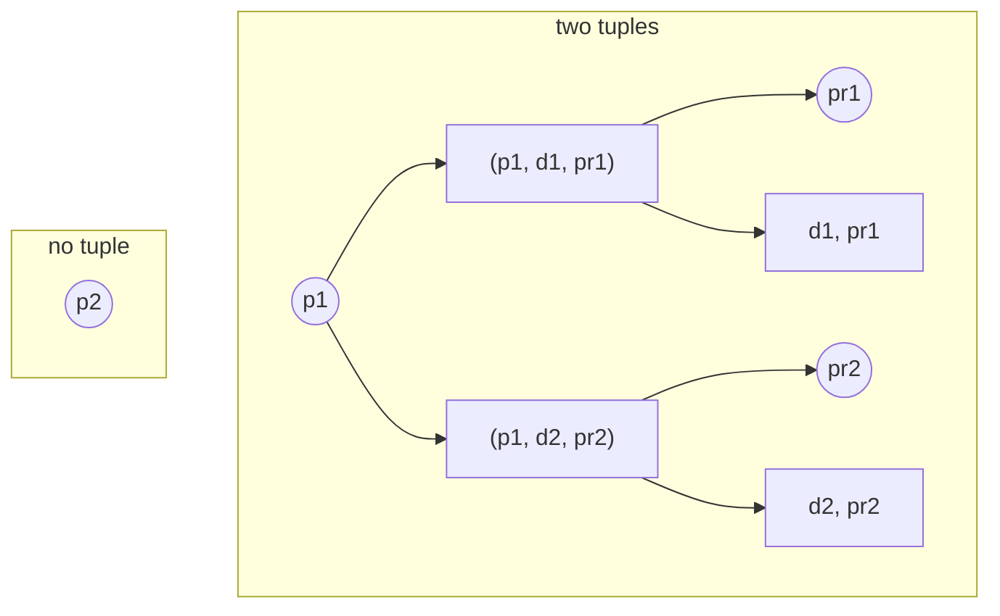
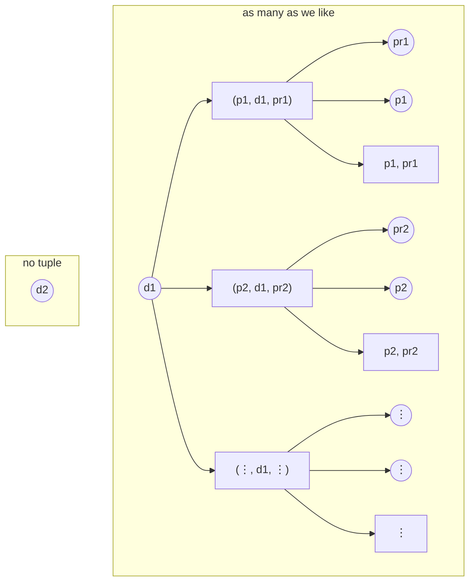
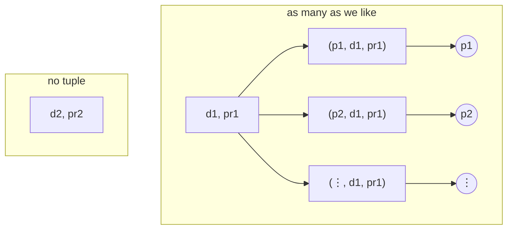

## Introduction

The posts before this one each added a piece. The [first]() showed
that a cardinality label on an edge has two opposite readings.
The [second]() replaced the label with a notation,
`Card(R; p; q) = (lower, upper)`, that says which reading is meant, and that is no longer limited to one
constraint per edge. The [third]() showed that
a design decides constraints it never writes down, and that a program can produce them on demand. The
[fourth]() gave the two rules, _decomposition_ and
_augmentation_, that derive one constraint from another.

The design below is a university research center. Its entity sets are `Person`, `Department`, and `Project`,
and it has three requirements to satisfy.

Let's do an exercise.

## The Design



People in the center have a `pID`, a name, and a phone number, and come in two kinds, `Employee` and
`Student`; departments have a `dID` and a location; projects have a `prID` and the language they are mostly
written in. The design has one relationship set, `work`, and all three entity sets take part in it.

The three requirements are:

1. A person can only be assigned to at most two departments at a time.
2. For each assigned department, a person cannot work on more than one project.
3. Every project must be associated with at least one department, with at least one person working on it.

## The Requirements, as Constraints

Let's take the three in turn.

### At Most Two Departments per Person

The first requirement fixes a person and counts departments. A person's departments are the ones appearing
in that person's `work` tuples, and the requirement allows at most two of them. The center does the assigning,
so a person need not be in any department. The lower bound stays at the default of zero:

`Card(work; {Person}; {Department}) = (0, 2)`

The requirement names the number 2, so the upper bound is 2. Written down, the constraint carries the number
rather than an `M` (_i.e._, an arbitrary number).

### At Most One Project per Person per Department

The second requirement counts projects per assignment, not per person. An assignment is a person _and_ a
department, which is what a pair-group `p` is for. A person in two departments can work on one project in
each, so one is not a bound on `{Person} → {Project}`. The bound of one is on the pair. Nothing requires an
assigned person to work on a project in that department either, so the lower bound is zero again:

`Card(work; {Person, Department}; {Project}) = (0, 1)`

### At Least One Department and One Person per Project

The third requirement fixes a project and counts. "At least one department, with at least one person working
on it" names two conditions, one department and one person. A count of `(person, department)` pairs gives both
at once: a project with a pair in it has a department and a person, and a project with a department and a
person in it has a pair. The requirement names no upper bound, so `*` is written there:

`Card(work; {Project}; {Person, Department}) = (1, *)`

The three requirements give three constraints:

| #   | The requirement                                    | As a constraint                                        |
| :-- | :------------------------------------------------- | :----------------------------------------------------- |
| 1   | at most two departments per person                 | `Card(work; {Person}; {Department}) = (0, 2)`          |
| 2   | at most one project per person per department      | `Card(work; {Person, Department}; {Project}) = (0, 1)` |
| 3   | at least one department and one person per project | `Card(work; {Project}; {Person, Department}) = (1, *)` |

## The Twelve Constraints



Three of the twelve are the requirements written down. The other nine follow from the design. Writing `p → q`
for `Card(work; p; q)`, the twelve constraints are:

| #   | Constraint                         | Bound             |
| :-- | :--------------------------------- | :---------------- |
| 1   | `{Person} → {Department}`          | `(0, 2)` explicit |
| 2   | `{Person} → {Project}`             | `(0, 2)` implied  |
| 3   | `{Department} → {Project}`         | `(0, *)`          |
| 4   | `{Person, Department} → {Project}` | `(0, 1)` explicit |
| 5   | `{Person, Project} → {Department}` | `(0, 2)` implied  |
| 6   | `{Department, Project} → {Person}` | `(0, *)`          |
| 7   | `{Department} → {Person}`          | `(0, *)`          |
| 8   | `{Project} → {Person}`             | `(1, *)` implied  |
| 9   | `{Project} → {Department}`         | `(1, *)` implied  |
| 10  | `{Project} → {Person, Department}` | `(1, *)` explicit |
| 11  | `{Department} → {Person, Project}` | `(0, *)`          |
| 12  | `{Person} → {Department, Project}` | `(0, 2)` implied  |

Three explicit, five implied, four left at the default.

## Where the Other Bounds Come From

The requirements gave three of the twelve. The design decides the other nine, and this section takes them in
turn.

**Constraint 5** in the table above comes from augmentation: `{Person, Project} → {Department}` = `(0, 2)`. A
`(person, project)` pair names a person, and the departments of the pair are among the departments of that
person. So a bound on `{Person}` over `{Department}` is also a bound on the pair:

`Card(work; {Person}; {Department}) = (0, 2)` ⇒ `Card(work; {Person, Project}; {Department}) = (0, 2)`

Both ends of the bound are reachable. A pair that is in no tuple counts zero, and a pair whose person works on
one project in two departments counts two. So the bound cannot be any tighter than `(0, 2)`. The requirements
say nothing about `(person, project)` pairs.

**Constraints 8 and 9** come from constraint 10. Constraint 10 counts `(person, department)` pairs per project.
Constraint 8 counts persons per project, and constraint 9 counts departments per project. Every tuple of a
project names one person and one department, so neither count can be zero. That is where the lower end of 1
comes from. Neither count has an upper end: no requirement names one, and a project can have as many people and
as many departments as we like.

**Constraints 2 and 12** come from constraints 1 and 4 together. Constraint 4 allows one project per
`(person, department)`, and constraint 1 allows two departments per person. A person is therefore in at most
two tuples. Constraint 2 counts projects per person, and each tuple names one project, so that count is at most
two (_i.e._, `pr1` and `pr2` in the diagram below). Constraint 12 counts `(department, project)` pairs per
person, and two tuples in the same department name the same project, so that count is at most two as well
(_i.e._, the pairs `d1, pr1` and `d2, pr2` in the same diagram). The lower end of both is 0, because constraint
1's lower end is 0. A person need not be in any department, and a person in no tuple counts nothing.

**The remaining four** stay at the default. Constraints 3, 7, and 11 count from a department; constraint 6
counts from a `(department, project)` pair.

No requirement forces a department to appear, so the lower end is 0 in all four. No requirement caps those
counts either, so the upper end is `*`: a department can carry any number of people, projects, or
`(person, project)` pairs, and one `(department, project)` pair can carry any number of people. The first
picture below is the department case, and the second is the pair.

## See Other Posts

The four posts before this one, in order:

1. [Look Here or Look Across]()
2. [Unified Cardinality Constraints]()
3. [Implicit Cardinality Constraints]()
4. [Decomposition and Augmentation]()
